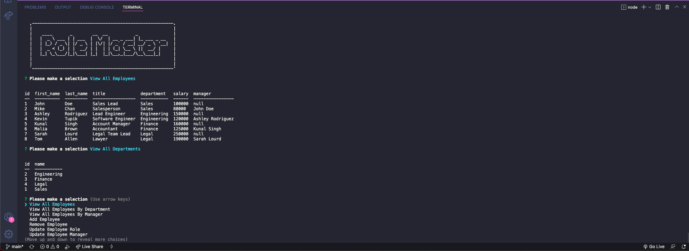

# Role Master

[](http://unlicense.org/)

## Description

Role Master allows users to organize their work force and keep tabs on essential information. Users will be able to create new employees and give them a role, salary, and department. You can assign managers to employees or assign existing employees to be managers. Employees can have their roles and departments updated too. Users will also be able to add and update roles and departments

## Table of Contents

- [Installation](#installation)
- [Usage](#usage)
- [Contributing](#contributing)
- [Questions](#questions)

### Installation

To install necessary dependencies, run the following command

```md
npm init -y
npm i
```

After running those commands in your termnial you will be need to add the table through MYSQL and seed the database.

### Usage

```md
npm run start
```

### Contributing

If you would like to contribute to this app please the fork reqo and submit pull request.


### Questions

If you have any questions please reach out via Github, my username jessemarino. 


